  

  
  

## 🛠️ Ma Stack Technologique

### 🤖 Intelligence Artificielle & ML

### 💻 Développement

### 📱 Mobile

  
## 📈 Mes Stats GitHub

  

  

## 🌟 Projets en Vedette

name: Generate Snake

on:
  schedule:
    - cron: "0 */12 * * *"
  workflow_dispatch:

jobs:
  build:
    runs-on: ubuntu-latest
    steps:
      - uses: Platane/snk@master
        with:
          github_user_name: orace18
          outputs: |
            dist/github-snake.svg
            dist/github-snake-dark.svg?palette=github-dark

  

  ## 🚀 Mon Parcours Professionnel

```mermaid
gantt
    title Expériences Professionnelles
    dateFormat  YYYY-MM
    section Entreprises
    WonderTeck           :2020-01, 2020-06
    TechoBenin          :2020-07, 2021-03
    AFT Group           :2021-04, 2021-12
    SICMA & Associés    :2022-01, 2022-08
    CIBE AFRICA         :2022-09, 2023-03
    Gemini & Co         :2023-04, 2023-11
    ValiisTech          :2023-12, 2024-06
    HE System 🔥        :2024-07, 2026-01
```

